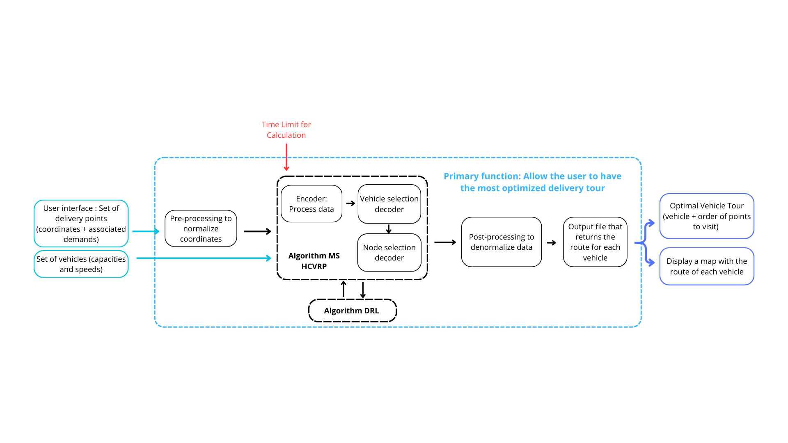

# Deep Reinforcement Learning for Solving the Heterogeneous Capacitated Vehicle Routing Problem

## Introduction

As part of my engineering studies at Telecom Physique Strasbourg, I took part in an engineering project. The project was proposed by the city of Strasbourg, which wanted to make it easier for its employees to get around when distributing materials or equipment.

The aim of this project was to create an IT tool that could be run from a PC. The application allows employees to enter all the data relating to their deliveries via an input interface. This includes information such as delivery locations, type and number of materials to be delivered. The tool calculates the optimum route in terms of time and profitability, and informs the selection of the vehicle or vehicles to be used for the deliveries scheduled for the day. 

## Technical choices

The programmation language choice was imposed by our client : we have coded our application in Python. The work was divided into two parts: the user interface and travel optimisation. I personally worked on the second, and more specifically on the architecture of the optimisation algorithm.

- For the graphical interface, we have chosen to use the Python library named Tkinter, the most complete of the libraries designed for graphical interfaces, as well as an improved version of it: Custom Tkinter, which provides a more modern, streamlined look. For map display, we used the Folium library. This Python library makes it easy to create interactive maps from geospatial data. It is based on the Leaflet JavaScript library and provides an easy-to-use interface for creating interactive maps in Python environments. We used the Opencage API to encode data, i.e. to change a written address into a GPS coordinate, and to use the map. APIs (Application Programming Interfaces) are software interfaces that 'connect' one piece of software or service to another in order to exchange data and functions.

- Like the travelling salesman problem or the rucksack problem, our optimisation problem is an NP-complete problem, i.e. although we can quickly check any proposed solution, we don't know how to find one efficiently. Approximation methods must then be used. Deep Learning is currently the most effective way of solving these problems. We have therefore chosen an algorithm that combines a Deep Reinforcement Learning model with a solution to the Problem of Routing Vehicles of Different Capacities (HCVRP) via a Minimum Path Sum (MS) search algorithm.

## Model framework

To solve this problem, we therefore chose a Deep Reinforcement Learning method based on the attention mechanism with a vehicle selection decoder taking into account the heterogeneous fleet constraint and a node selection decoder taking into account route construction, which learns to build a solution by automatically selecting a vehicle and a node for that vehicle at each stage.

To resolve the instance, the raw features are processed by the encoder for better representation. Our policy network first selects a vehicle from the entire fleet via the vehicle selection decoder, and then selects a node for that vehicle to visit via the node selection decoder at each route construction step. The vehicle and node selected form the action for that step, which is then used to update the states. This process is repeated until all customers have been served.

A. The encoder's task is to transform the input data into a format better suited to the task the network is supposed to perform. Its role is to simplify the calculation for better feature extraction. 

B. The decoder sequentially produces a customer at each stage to link each customer to a vehicle until all customers have been served.

The algorithm is trained using REINFORCE with a greedy rollout baseline.

## Operation of the application

The logic of the application and the interweaving of the two main parts, in this case the optimisation and user input interface parts, are described in the functional architecture diagram of our application below:

Our trip optimisation algorithm requires as input an instance of each customer's requests and the coordinates of the corresponding delivery points, supplied via the input interface. The characteristics of the delivery vehicles are also input data. The central part corresponds to the architecture of our code, which is used to retrieve the optimal delivery route.

## Dependencies

* Python>=3.7
* NumPy
* SciPy
* [PyTorch](http://pytorch.org/)=1.3.0
* tqdm
* [tensorboard_logger](https://github.com/TeamHG-Memex/tensorboard_logger)
* Matplotlib (optional, only for plotting)